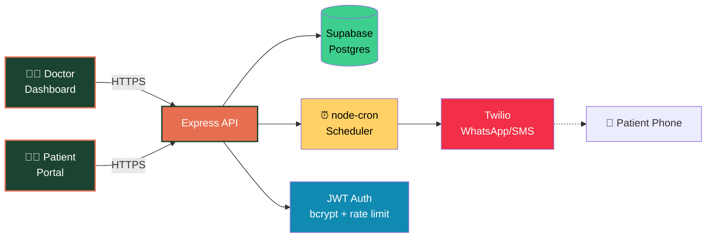

<div align="center">

<p align="center">
  
</p>

<!-- Badges -->

<p>
  
  
  
  
  
  
  
  
</p>

<p>
  <a href="#-overview">Overview</a> •
  <a href="#-features">Features</a> •
  <a href="#-architecture">Architecture</a> •
  <a href="#-roadmap">Roadmap</a>
</p>

<!-- Animated typing intro -->

<a href="https://git.io/typing-svg">
  
</a>

</div>

---

## 🌿 Overview

**CareTrack** is a two-sided web platform that helps small clinics keep chronic-disease patients (diabetes, hypertension, asthma) on track **between** visits.

Doctors create a patient profile with medications, follow-up schedule, and tests. The system automatically sends reminders over **WhatsApp / SMS** — no app install required. Patients log their own readings (blood sugar, BP, weight) from a simple web portal. A doctor dashboard **passively flags** who's falling behind, so the clinic can act before a missed follow-up becomes a crisis.

> *Chronic disease isn't managed in the clinic — it's managed in the weeks between visits, when patients are on their own. CareTrack keeps that gap covered.*

---

## ✨ Features

<table>
<tr>
<td width="50%" valign="top">

### 👨‍⚕️ For Doctors

* 🗂 **Patient profiles** — condition, medications, tests, schedule
* 📊 **Dashboard with passive flags** — 6 rule-based risk signals
* 📈 **Trend charts** — sugar, systolic BP, diastolic BP, weight
* 📅 **Appointment scheduling** — book, confirm, reschedule, cancel
* 🔔 **Bulk reminder action** — nudge everyone missing readings
* 🧪 **Test tracking** — add/edit tests, due dates, auto-overdue detection

</td>
<td width="50%" valign="top">

### 🧑‍🦱 For Patients

* 📱 **No app install** — works in any browser
* 💬 **WhatsApp / SMS reminders** — checkups, meds, tests, readings
* ✍️ **Self-logging** — sugar, BP (as `120/90`), weight
* 📉 **Personal trend view** — see your own history
* 📅 **Self-booking** — request appointments, reschedule, cancel
* 🔐 **Password change** — self-service

</td>
</tr>
</table>

### 🤖 Automated (Cron)

| Reminder              | Trigger                                     | Cadence       |
| --------------------- | ------------------------------------------- | ------------- |
| 💊 Medication         | `medications[].times` matches current HH:MM | Every 15 min  |
| 🩺 Checkup            | `next_checkup_date` passes                  | Hourly        |
| 🧪 Test               | `tests[].due_date` passes                   | Every 6 hours |
| 📓 Reading            | No reading in `reading_due_days` days       | Daily 9 AM    |
| 🕒 Missed appointment | `scheduled_at` passes without action        | Hourly        |
| 👋 Welcome            | On patient creation                         | Immediate     |

---

## 🏗 Architecture

<div align="center">



</div>

### 🛠 Tech Stack

<table>
<tr>
<th>Layer</th><th>Technology</th><th>Purpose</th>
</tr>
<tr>
<td><b>Frontend</b></td>
<td>React 18 · Vite · Tailwind · Recharts · React Router · Axios</td>
<td>Doctor dashboard + patient portal</td>
</tr>
<tr>
<td><b>Backend</b></td>
<td>Node.js · Express · bcryptjs · jsonwebtoken · express-rate-limit</td>
<td>REST API, auth, business logic</td>
</tr>
<tr>
<td><b>Database</b></td>
<td>Supabase (Postgres) · JSONB columns for medications/tests</td>
<td>Persistent storage</td>
</tr>
<tr>
<td><b>Scheduler</b></td>
<td>node-cron</td>
<td>Automatic reminder scans</td>
</tr>
<tr>
<td><b>Notifications</b></td>
<td>Twilio (WhatsApp/SMS) — mock mode fallback</td>
<td>Patient delivery</td>
</tr>
<tr>
<td><b>Deployment</b></td>
<td>Vercel (frontend) · Render (backend)</td>
<td>Hosting</td>
</tr>
</table>

---

## 📁 Project Structure

```text
caretrack/
├── backend/
│   ├── src/
│   │   ├── config/supabase.js          # Supabase client
│   │   ├── middleware/                 # auth, roles, ownership
│   │   ├── routes/                     # auth, patients, readings, ...
│   │   ├── services/reminder.service.js # Twilio + scans
│   │   ├── jobs/scheduler.js           # node-cron
│   │   └── app.js
│   ├── server.js
│   └── package.json
│
└── frontend/
    ├── src/
    │   ├── api/client.js               # axios + JWT interceptor
    │   ├── components/                 # Navbar, PatientCard, charts, ...
    │   ├── context/AuthContext.jsx
    │   ├── pages/                      # Doctor + Patient views
    │   └── App.jsx
    └── package.json
```

---

## 🗺 Roadmap

<table>
<tr><td>✅</td><td>Patient profiles with medications, tests, schedule</td></tr>
<tr><td>✅</td><td>Automated WhatsApp/SMS reminders via cron</td></tr>
<tr><td>✅</td><td>Patient self-logging (sugar, BP, weight)</td></tr>
<tr><td>✅</td><td>Doctor dashboard with 6 automatic flags</td></tr>
<tr><td>✅</td><td>Appointment booking, reschedule, cancel</td></tr>
<tr><td>✅</td><td>JWT auth, bcrypt, rate limiting, role separation</td></tr>
<tr><td>🔜</td><td>Urdu / Punjabi / Pashto / Sindhi voice reminders (IVR)</td></tr>
<tr><td>🔜</td><td>Offline-first logging with background sync (PWA)</td></tr>
<tr><td>🔜</td><td>ML-based risk prediction from reading history</td></tr>
<tr><td>🔜</td><td>Pharmacy integration for automatic refill reminders</td></tr>
<tr><td>🔜</td><td>Lab integration for automatic test result import</td></tr>
<tr><td>🔜</td><td>Multi-clinic / multi-doctor support</td></tr>
</table>

---

## 🤝 Contributing

We follow a **feature-branch + pull request** workflow.

```bash
# 1. Update main
git checkout main && git pull origin main

# 2. Create feature branch
git checkout -b feature/your-feature-name

# 3. Work, commit, push
git add .
git commit -m "feat: short description"
git push -u origin feature/your-feature-name

# 4. Open PR on GitHub → request review
```

**Branch prefixes:** `feature/` · `fix/` · `docs/` · `refactor/`

**Rules:**

* Never push directly to `main`
* One feature per branch
* Run both servers before pushing
* Small commits, clear messages

---

## 🔐 Security Notes

* Passwords hashed with **bcrypt** (cost 8)
* JWTs signed with **7-day expiry**
* Login endpoint **rate-limited** (10 attempts / 15 min / IP)
* **Ownership checks** on every patient-scoped route
* **Role guards** on doctor-only endpoints
* Supabase service key is **backend-only** — never exposed to frontend
* `.env` files contain secrets — do not commit to public forks

---

## 📜 License

Released under the **MIT License** — free to use, modify, and distribute.

---

<div align="center">

<!-- Animated footer -->


<p>
  <b>Never miss a follow-up.</b><br/>
  <sub>Built with 💚 for small clinics doing big work.</sub>
</p>


</div>
``` 
